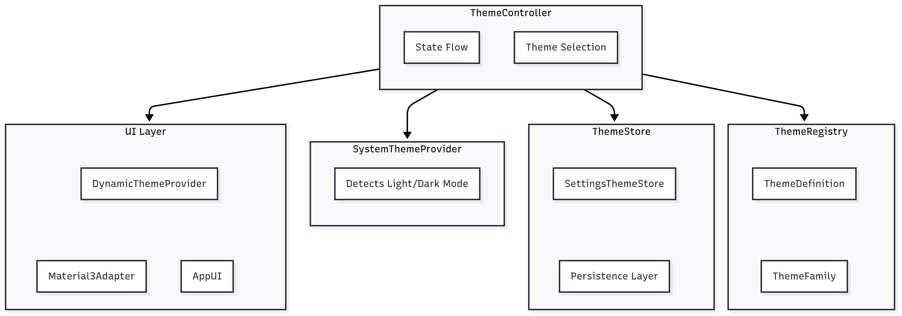

# 🌌 KMPalette – Kotlin Multiplatform Library

[](https://central.sonatype.com/artifact/io.github.iammohdzaki.kmpalette/theme-core)
[](https://kotlinlang.org/)
[](LICENSE)
[-green)]()
[](https://github.com/iammohdzaki/KMPalette-Theme-Library/actions/workflows/publish.yml)

A **Kotlin Multiplatform** library for **dynamic theme management** using **Jetpack Compose Multiplatform**.

It allows you to:

- Register **custom theme families** (Light + Dark variants)
- Switch between **System / Light / Dark modes**
- Persist theme selection with pluggable **ThemeStore**
- Provide **Material 3 adapters** with support for **custom typography & shapes**
- Preview and switch themes dynamically with a **built-in Theme Picker UI**

---

## ✨ Features
- 🎨 **Theme Registry** – register and manage theme families
- 🛠 **Theme Controller** – central manager for selection, persistence, and system integration
- 📦 **Composable Adapter** – plug your UI with Material 3 (typography, shapes, colors)
- 🌗 **Theme Families** – group Light/Dark variants under a single name
- 💾 **Persistence** – pluggable `ThemeStore` (works with `MultiplatformSettings` or custom stores)
- 🖥 **System-aware** – respects system theme if enabled
- 📱 **Composable UI** – `ThemePickerBottomSheet` & sample `AppScaffold`

---

<p align="center">  </p>

## 🚀 Installation

Add the dependency to your `commonMain`:

```kotlin
commonMain.dependencies {
    implementation("io.github.iammohdzaki.kmpalette:theme-core:<check-tag-eg.0.0.1>")
}
```

## 📐 Architecture

Below is the high-level architecture of the **Dynamic Theme Multiplatform Library**:

<p align="center">  </p>

---

## 📦 Core Concepts

### 1. ThemeDefinition
Represents a **single theme variant** (Light or Dark).

```kotlin
val lightTheme = ThemeDefinition(
    id = ThemeId("ocean_light"),
    displayName = "Ocean Light",
    palette = lightPalette
)
```

---

### 2. ThemeFamily
A **pair of Light/Dark themes** grouped under a single name.

```kotlin
val oceanFamily = ThemeFamily(
    displayName = "Ocean",
    light = oceanLight,
    dark = oceanDark
)
```

---

### 3. ThemeRegistry
Registers all available themes.

```kotlin
val registry = DefaultThemeRegistry().apply {
    registerFamily(oceanFamily)
    registerFamily(forestFamily)
}
```

---

### 4. ThemeController
Manages active theme, system mode, and persistence.

```kotlin
val controller = ThemeController(
    registry = registry,
    store = SettingsThemeStore(Settings()), // pluggable
    system = PlatformSystemThemeProvider(),
    defaultThemeId = ThemeId("m3_light")
)
```

---

### 5. Compose Adapter
Applies theme to your UI (Material 3).

```kotlin
DynamicThemeProvider(
    controller = controller,
    adapter = Material3Adapter(
        typography = CustomTypography(),
        shapes = CustomShapes()
    )
) {
    AppScaffold()
}
```

---

## 🎨 Theme Picker UI

A ready-to-use **Bottom Sheet** for switching themes:

```kotlin
ThemePickerBottomSheet(
    onDismiss = { showSheet = false }
)
```

It shows:
- **Theme mode toggle** → System / Light / Dark
- **Theme families** → Select from available themes
- **DualVariantCircle** → Preview both Light & Dark variant in one icon

---

## 🛠 Persistence

Implement your own `ThemeStore` if you don’t want to use `MultiplatformSettings`:

```kotlin
interface ThemeStore {
    suspend fun load(): ThemeSelection?
    suspend fun save(selection: ThemeSelection)
}
```

Example: `SettingsThemeStore` using `MultiplatformSettings`.

---

## 🧑‍💻 Example :

A sample scaffold to showcase theme switching:

```kotlin
@Composable
fun App() {
    val controller = remember {
        val registry = DefaultThemeRegistry().apply {
            registerFamilies(DefaultMaterial3Themes.families)
        }
        ThemeController(
            registry = registry,
            store = SettingsThemeStore(Settings()), // You can plug any persistence like Multiplatform Settings,DataStore etc.
            system = PlatformSystemThemeProvider(),
            defaultThemeId = ThemeId("m3_light")
        )
    }

    DynamicThemeProvider(
        controller = controller,
        adapter = Material3Adapter(),
        typography = SansTypography()
    ) {
        AppScaffold()
    }
}
```

---

## 🔧 Extending the Library

- Add new themes by **registering families** in the registry
- Provide **custom adapters** (e.g., Material 2, your own design system)
- Replace persistence with your own store (e.g., `DataStore`, `Database`)
- Add new UI components (custom pickers, theme previews)

---

## 📄 License
[MIT License](LICENSE)
