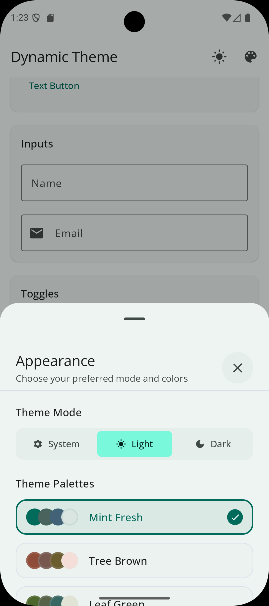
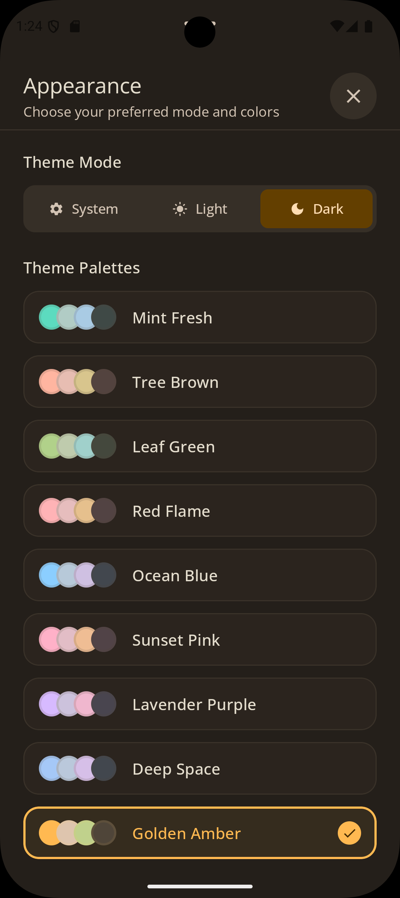
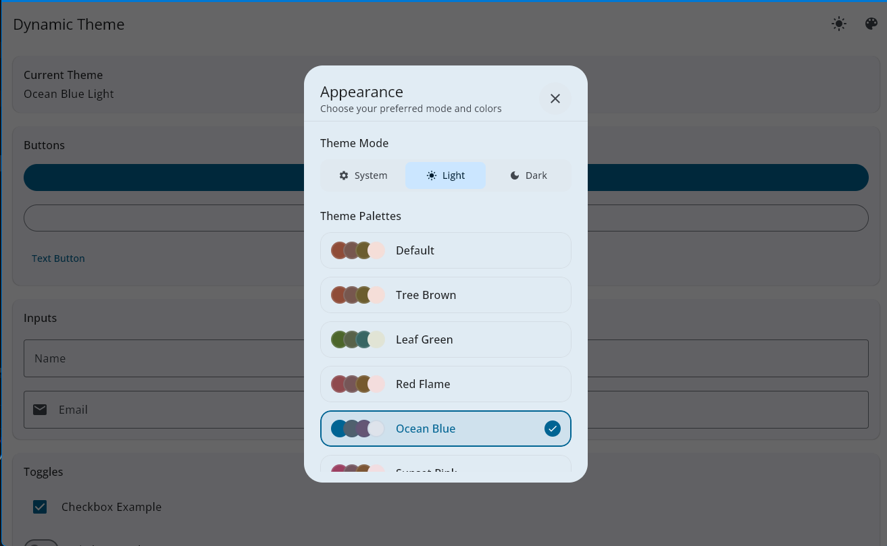
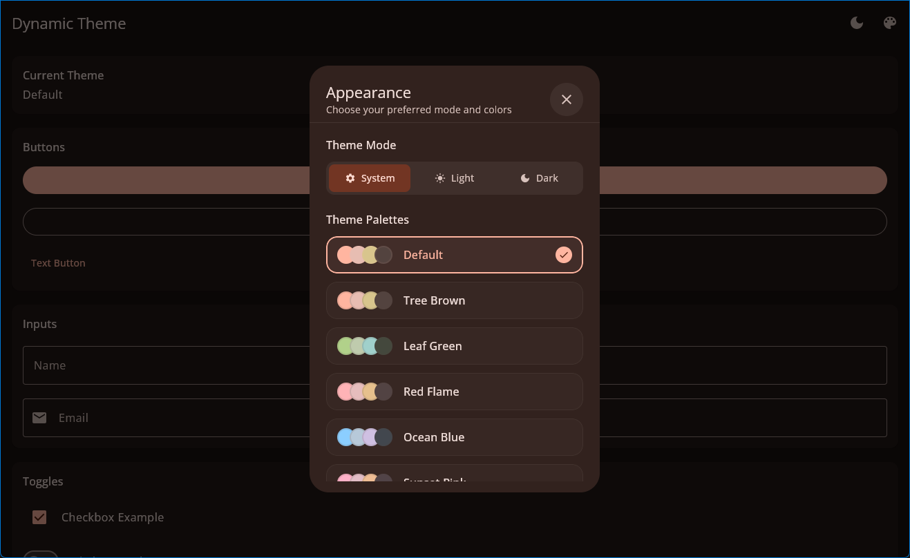
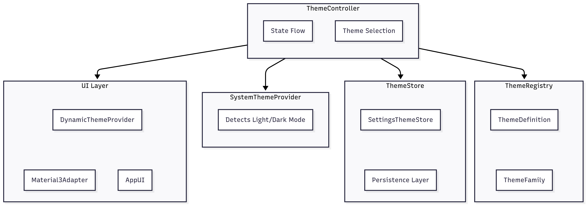

# 🌌 KMPalette – Kotlin Multiplatform Library

[](https://central.sonatype.com/artifact/io.github.iammohdzaki.kmpalette/theme-core)
[](https://kotlinlang.org/)
[](LICENSE)
[-green)]()
[](https://github.com/iammohdzaki/KMPalette-Theme-Library/actions/workflows/publish.yml)

A **Kotlin Multiplatform** library for **dynamic theme management** using **Jetpack Compose Multiplatform**.

It allows you to:

- Register **custom theme families** (Light + Dark variants)
- Switch between **System / Light / Dark modes**
- Persist theme selection with pluggable **ThemeStore**
- Provide **Material 3 adapters** with support for **custom typography & shapes**
- Preview and switch themes dynamically with a **built-in Theme Picker UI**

---

## ✨ Features
- 🎨 **Theme Registry** – register and manage theme families
- 🛠 **Theme Controller** – central manager for selection, persistence, and system integration
- 📦 **Composable Adapter** – plug your UI with Material 3 (typography, shapes, colors)
- 🌗 **Theme Families** – group Light/Dark variants under a single name
- 💾 **Persistence** – pluggable `ThemeStore` (works with `MultiplatformSettings` or custom stores)
- 🖥 **System-aware** – respects system theme if enabled
- 📱 **Composable UI** – `ThemePickerBottomSheet` & sample `AppScaffold`

---

<p align="center">
  &nbsp;&nbsp;
  
</p>
<p align="center">
  &nbsp;&nbsp;
  
</p>

## 🚀 Installation

Add the dependency to your `commonMain`:

```kotlin
commonMain.dependencies {
    implementation("io.github.iammohdzaki.kmpalette:theme-core:<check-tag-eg.0.0.1>")
}
```

## 📐 Architecture

Below is the high-level architecture of the **Dynamic Theme Multiplatform Library**:

<p align="center">  </p>

---

## 📦 Core Concepts

### 1. ThemeDefinition
Represents a **single theme variant** (Light or Dark).

```kotlin
val lightTheme = ThemeDefinition(
    id = ThemeId("ocean_light"),
    displayName = "Ocean Light",
    palette = lightPalette
)
```

---

### 2. ThemeFamily
A **pair of Light/Dark themes** grouped under a single name.

```kotlin
val oceanFamily = ThemeFamily(
    displayName = "Ocean",
    light = oceanLight,
    dark = oceanDark
)
```

---

### 3. ThemeRegistry
Registers all available themes.

```kotlin
val registry = DefaultThemeRegistry().apply {
    registerFamily(oceanFamily)
    registerFamily(forestFamily)
}
```

---

### 4. ThemeController
Manages active theme, system mode, and persistence.

```kotlin
val controller = ThemeController(
    registry = registry,
    store = SettingsThemeStore(Settings()), // pluggable
    system = PlatformSystemThemeProvider(),
    defaultThemeId = ThemeId("m3_light")
)
```

---

### 5. Compose Adapter
Applies theme to your UI (Material 3).

```kotlin
DynamicThemeProvider(
    controller = controller,
    adapter = Material3Adapter(
        typography = CustomTypography(),
        shapes = CustomShapes()
    )
) {
    AppScaffold()
}
```

---

## 🎨 Theme Picker UI

A ready-to-use **Responsive Picker UI** for switching themes:

```kotlin
ThemePickerBottomSheet(
    onDismiss = { showSheet = false }
)
```

### 📱 Responsive & Adaptive Layouts
The picker automatically adjusts to provide the best design experience based on the target platform:
- **Android & iOS**: Shows as a native **Modal Bottom Sheet**.
- **Desktop (JVM) & Web (WasmJS)**: Shows as a centered, focused **Modal Dialog** to prevent stretched layouts on wide desktop monitors.

It shows:
- **Segmented Mode Selector** → Capsule switcher for theme modes (System, Light, Dark)
- **Theme Palettes** → Dynamic selection list of all registered theme families
- **Palette Previews** → Overlapping 4-color circles representing the active colors (Primary, Secondary, Tertiary, Surface Variant) of each family

---

## 🛠 Persistence

Implement your own `ThemeStore` if you don’t want to use `MultiplatformSettings`:

```kotlin
interface ThemeStore {
    suspend fun load(): ThemeSelection?
    suspend fun save(selection: ThemeSelection)
}
```

Example: `SettingsThemeStore` using `MultiplatformSettings`.

---

## 🧑‍💻 Example :

A sample scaffold to showcase theme switching:

```kotlin
@Composable
fun App() {
    val controller = remember {
        val registry = DefaultThemeRegistry().apply {
            registerFamilies(DefaultMaterial3Themes.families)
        }
        ThemeController(
            registry = registry,
            store = SettingsThemeStore(Settings()), // You can plug any persistence like Multiplatform Settings,DataStore etc.
            system = PlatformSystemThemeProvider(),
            defaultThemeId = ThemeId("m3_light")
        )
    }

    DynamicThemeProvider(
        controller = controller,
        adapter = Material3Adapter(),
        typography = SansTypography()
    ) {
        AppScaffold()
    }
}
```

---

## 🔧 Extending the Library

### 1. Register Custom Themes Easily
Instead of mapping colors manually, use the boilerplate-reducing helper extension functions in your source code:
- `ColorScheme.toThemeDefinition(...)` converts a standard Compose `ColorScheme` to a `ThemeDefinition`.
- `createThemeFamily(...)` builds a paired Light/Dark `ThemeFamily` in a single line:

```kotlin
val myFamily = createThemeFamily(
    id = "neon_city",
    displayName = "Neon City",
    lightScheme = neonLightColorScheme,
    darkScheme = neonDarkColorScheme
)
registry.registerFamily(myFamily)
```

### 2. Custom Adapters (e.g., Experimental `MaterialExpressiveTheme`)
The flexible `ComposeThemeAdapter` structure makes the library 100% future-proof. For example, if you want to support experimental expressive motion and styling features in newer Compose versions, you can implement a custom adapter in your app:

```kotlin
@OptIn(ExperimentalMaterial3ExpressiveApi::class)
class ExpressiveM3Adapter : ComposeThemeAdapter {
    @Composable
    override fun MaterialTheme(
        theme: ThemeDefinition,
        typography: Typography?,
        shapes: Shapes?,
        content: @Composable () -> Unit
    ) {
        val colors = ColorScheme( /* Map theme.palette colors... */ )
        MaterialExpressiveTheme(
            colorScheme = colors,
            typography = typography ?: MaterialTheme.typography,
            shapes = shapes ?: MaterialTheme.shapes,
            content = content
        )
    }
}
```
And pass it directly to `DynamicThemeProvider(adapter = ExpressiveM3Adapter())`.

---

## 🤖 AI Integration Skill

If you are using an AI coding assistant (such as GitHub Copilot, Cursor, or Gemini) to integrate this library, you can refer it to the [SKILL.md](file:///D:/Projects/KMPDynamicTheme/SKILL.md) file at the root of the repository. It contains structured instructions, design guidelines, and code snippets formatted for AI context injection.

---

## 📄 License
[MIT License](LICENSE)
